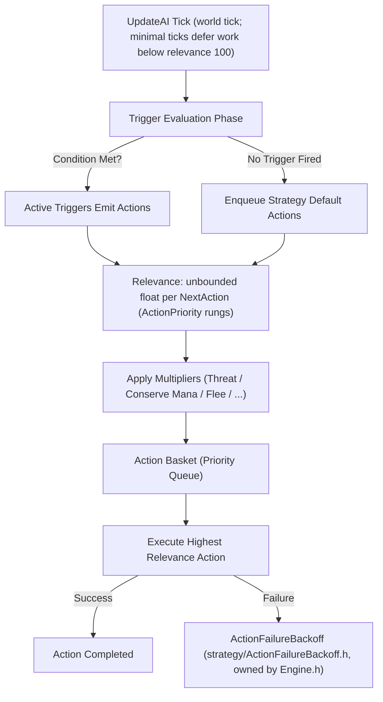

# Strategy Engine & Action Scheduling

TortoiseBots uses an action-scheduling engine derived from Playerbots. Rather than running a monolithic behavior tree or hardcoded FSM, bot behavior emerges from composable **Strategies**, **Triggers**, **Actions**, and **Multipliers**.

## The Execution Cycle

## Core Building Blocks

| Component | Responsibility | Example Class / Implementation | Relevance / Effect |
| :--- | :--- | :--- | :--- |
| **Strategy** | High-level posture or intent container | `FrostMageStrategy`, `HealPaladinStrategy` / `HealPriestStrategy`, `PreHealStrategy`, `PullBackStrategy` | Registers triggers, actions, and defaults |
| **Trigger** | Context condition check | `CriticalHealthTrigger`, `LowManaTrigger`, `InterruptSpellTrigger` / `InterruptEnemyHealerTrigger` | Evaluates boolean state (`Check()` / `IsActive()`) |
| **Action** | Concrete world interaction or spell cast | `CastFlashHealAction`, `ReachSpellAction`, `EatAction` | Returns `true` on execution success |
| **Multiplier** | Contextual relevance adjuster | `ThreatMultiplier`, `ConserveManaMultiplier`, `FleeMultiplier` | Scales base action score (e.g. 1.5x, 0.0x) |
| **Backoff** | Anti-looping failure throttling | `ActionFailureBackoff` in `strategy/ActionFailureBackoff.h`, owned by `Engine.h` | Exponential TTL suppression on repeated failure |

---

## Action Relevance Tiers

Relevance is an unbounded float per `NextAction` (default `0.0f`); the action queue seeds its best-match search at `-400` with no clamp. The conventional rungs come from the discrete `ActionPriority` enum:

`ACTION_IDLE` (1), `ACTION_DEFAULT` (5), `ACTION_NORMAL` (10), `ACTION_HIGH` (20), `ACTION_MOVE` (30), `ACTION_INTERRUPT` (40), `ACTION_DISPEL` (50), `ACTION_LIGHT_HEAL` (60), `ACTION_MEDIUM_HEAL` (70), `ACTION_CRITICAL_HEAL` (80), `ACTION_EMERGENCY` (90), `ACTION_PASSTROUGH` (100).

Typical occupants: rotational DPS around `NORMAL`/`HIGH` (10–20), movement at `MOVE` (30), interrupts at `INTERRUPT` (40), heals climbing `LIGHT`/`MEDIUM`/`CRITICAL` (60/70/80), emergencies at `EMERGENCY` (90), passthrough overrides at 100. Strategies add small offsets (e.g. `ACTION_NORMAL + 3`) to order within a rung.
