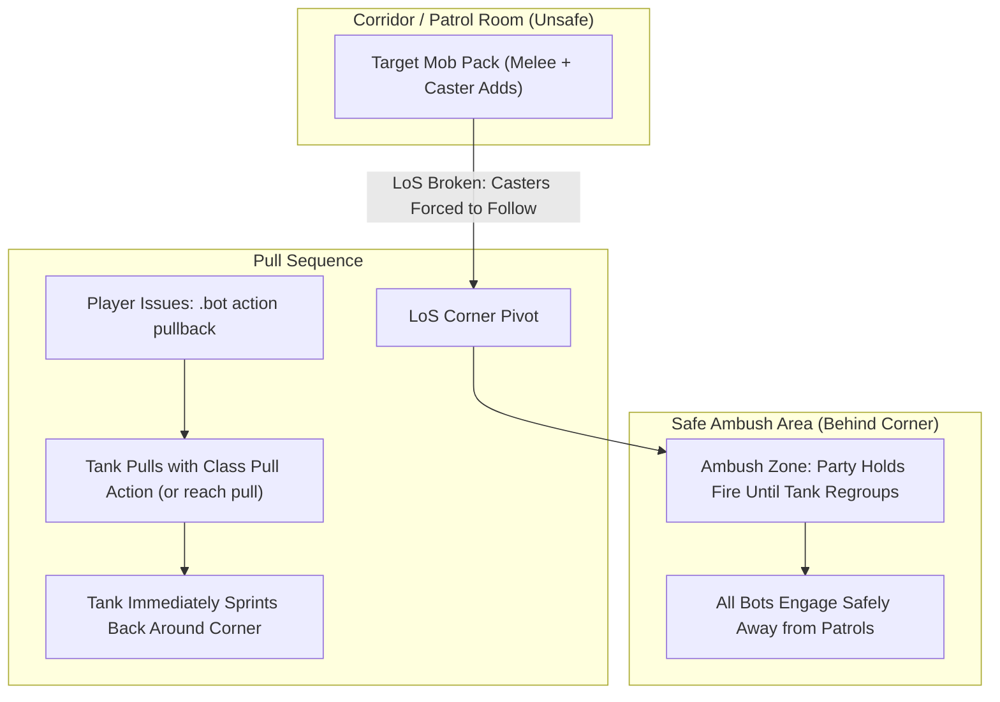

# Dungeon & Raid Tactics Guide

Running 5-player dungeons with companion bots is one of the most rewarding ways to experience Vanilla and Turtle WoW. However, dungeon mobs hit hard, patrol packs add unexpectedly, and casters flee into adjacent rooms. 

This guide outlines practical field tactics to ensure smooth dungeon runs without unnecessary wipes.

---

## 1. The Five Golden Rules of Bot Dungeoneering

1. **Pull to LoS Corners, Don't Charge:** Use `.bot action pullback` so the tank pulls and runs back to you around a corner. Never let bots fight out in open corridors where patrols roam.
2. **Toggle AoE OFF on CC Packs:** Before pulling packs where you plan to *Polymorph* or *Sap*, run `.bot action aoe off`. This prevents Mages (*Blizzard*), Warlocks (*Rain of Fire*), and Hunters (*Multi-Shot*) from accidentally breaking crowd control.
3. **Always Mark the Primary Target with Skull:** Issue `.bot action focus skull`. DPS treat the Skull-marked target as their kill priority (it sets the mark and issues one attack; normal target selection — peels, CC protection, re-targeting — still applies).
4. **Give the Tank Two Seconds:** Tanks tab-target *Sunder Armor* (warlock pets add *Torment*) based on lowest personal threat. Give them 2–3 seconds to establish initial aggro before nuking.
5. **Keep `.bot summon <Name>` Ready:** If a bot gets stuck on tricky instance terrain (like Blackrock Depths stairs or Gnomeregan elevators), `.bot summon <Name>` snaps them directly to you out of combat (requires `NonGmFreeSummon = 1` unless GM).

---

## 2. Pulling Mechanics & Line-of-Sight (LoS)

Open corridors are death traps in dungeons like Deadmines, Scarlet Monastery, and Stratholme. Casters stand at 30 yards casting fireballs while melee mobs surround your healer.

### The Pullback Maneuver (`.bot action pullback`)
When you target an enemy mob and issue `.bot action pullback`:
1. The server picks the puller by precedence: your targeted bot, else any bot designated `.bot role <Name> tank` (any class), else a native tank-spec bot.
2. The tank uses its class pull action (ranged shot/throw, *Judgement*, *Faerie Fire*, *Serpent Sting*, or *Lightning Bolt*) — or closes in and body-pulls (`reach pull`) when no ranged option exists — applies immediate threat, and immediately sprints back to your party's current location.
3. Non-tank bots hold fire until the tank reaches the regroup anchor, drawing the entire mob pack safely around the corner into your ambush.



---

## 3. Crowd Control (CC) Protocol

Crowd control is essential for multi-caster pulls in level 40+ dungeons.

### Standard Raid Target Icon Assignments

| Raid Icon | Primary Class & Ability | Valid Targets | Notes |
| :---: | :--- | :--- | :--- |
| **Moon** | **Mage** (*Polymorph*) / **Rogue** (*Sap*) | Beasts, Humanoids | Rogue must be in stealth prior to pull for Sap. |
| **Star** | **Priest** (*Shackle Undead*) / **Paladin** (*Turn Undead*) | Undead only | Crucial in Stratholme, Scholomance, and Shadowfang Keep. |
| **Diamond** | **Warlock** (*Banish* / *Fear*) | Demons, Elementals (Banish); Fear only on its assigned mark | Banish completely immunizes target from damage. *Seduce* is not a bot CC executor. |
| **Triangle** | **Hunter** (*Freezing Trap* / *Scare Beast*) / **Druid** (*Hibernate* / *Entangling Roots*) | Beasts, Dragonkin | Hunter drops trap; tank guides mob over the trap. |

### Issuing CC In-Game
* Target the mob you want CC'd and type:
  ```text
  .bot action cc moon
  ```
* The mark is assigned to exactly one bot (exclusive ownership); reassigning it moves ownership. When no owned bot is targeted, the server selects the capable bot with the best-fitting CC for that target (Sap before the pull, then Shackle/Banish/Hibernate/Polymorph/traps, Fear last); the same target and state always pick the same bot.
* Dismiss with `.bot action cc clear` (targeted bot, or the whole owned party when untargeted).
* **Dungeon rule:** inside non-raid dungeons bots CC only their assigned mark; in the open world they may CC a free pick. Bots never CC over an existing CC, and AoE triggers refuse packs holding a breakable CC.
* **Automatic Discipline:** Once applied, party bots and pets are strictly blocked from attacking the crowd-controlled target until all other active threats are dead.

---

## 4. Wipe Recovery & Instance Navigation

If your group wipes, follow this checklist to recover quickly:

### Releasing Spirit & Corpse Runs
1. When dead, whisper your bots `/w <BotName> release` (or type `.bot command <Name> release`).
2. Once in ghost form at the graveyard, issue `/w <BotName> corpse run`.
3. Ghost bots will path organically back to the instance portal and zone inside.
4. If a bot gets stuck outside the dungeon entrance, simply zone in yourself and type `.bot summon <Name>` to gather them safely at the instance threshold (requires `NonGmFreeSummon = 1` unless GM).

### Elevators, Boats & Ledges
* In complex vertical dungeons (Gnomeregan, Sunken Temple, Blackrock Spire), bots can occasionally desync when jumping down ledges or riding elevators.
* Always wait for bots at the bottom of elevators or after ledge drops, then click **Summon** in `/tbm` to regroup before engaging the next pack.

---

## 6. Raid Survival (MC / Onyxia / BWL / Naxx)

Entering a raid map auto-enables the `dungeon` transition engine, which swaps in the matching raid tactics (`molten core`, `onyxia's lair`, `blackwing lair`, `naxxramas`) and tears them down on exit. Four universal behaviors run on the reaction engine in any raid:

- **Bomb runout:** carriers of *Living Bomb* (Geddon), *Burning Adrenaline* (Vaelastrasz), or *Mutating Injection* (Grobbulus) run 30yd clear of the raid anchor (`AiPlayerbot.BombRunoutDistance`).
- **Hazard evasion:** lava bombs, void zones, and poison clouds trigger the shared hazard move-away as a reactive step-out (no persistent path avoidance yet).
- **Dragon geometry:** non-tanks flank out of breath/tail cones automatically; order tanks with `.bot action raid tankface` to drag the head away from the raid.
- **Ranged spread:** stacked casters split 12yd apart (`AiPlayerbot.HazardEvasionDistance`).

Encounter notes: MC runes douse via `.bot action raid douse` (Eternal Quintessence 22754 first, Aqual 17333 fallback); Onyxia phase 2 swaps bots to `shoot` + spread while airborne; BWL rogues disarm suppression devices (wired in both combat and non-combat states); 4H mark carriers (3+ stacks) rotate out via hazard move.

## 7. Custom Turtle Raids (Emerald Sanctum / Lower Karazhan / Karazhan Crypt)

Zone-ins for Map 807, 532, and 800 swap in `emerald sanctum`, `lower karazhan`, and `karazhan crypt` via the same `dungeon` engine (gated by `AiPlayerbot.EnableCustomRaidTactics = 1`; toggle per-bot with `.bot action raid custom [status|on|off]`). Static mechanics from core scripts:

- **Emerald Sanctum (Solnius 60748):** tanks hold the head away from *Acid Breath* (24839); *Emerald Rot* (56508) carriers run out via the shared bomb action; *Call of Nightmare* (46079) add waves (Suppressor 61212, Scalebane 60746, Dragonkin 60743, Wyrmkin 60745) trigger add focus.
- **Lower Karazhan (Araxxna 61221 / Moroes 61225):** spiderling swarms (entry 30008) trigger AoE cleave; Moroes smoke bomb (57096) forces tank-assist re-target.
- **Karazhan Crypt (800):** set `.bot formation near` manually before entering — narrow tunnels clip wide formations through walls. Door/lever puzzles stay manual pending playtesting (issue #237).

---

## 5. Dungeon Loot & Item Upgrades

### Loot Rolling Rules
* Bots participate in standard party loot rolls (`Need`, `Greed`, `Pass`).
* **Need on Empty Slots (`AiPlayerbot.RollBadItemsWithPlayer = 1`):** When enabled in `aiplayerbot.conf`, bots also roll Need on empty-slot filler (otherwise Greed); genuine upgrades (`ITEM_USAGE_EQUIP`) are always Needed regardless of the flag.

### Reagents & Food Sharing
* If you have a Mage or Warlock bot in your group, open trade with them (`/w <Name> trade`); they auto-add conjured food, water, or healthstones into the already-open window out of combat.
* To force an owned bot to equip a dropped dungeon item from their bags:
  ```text
  .bot command <BotName> equip [Item Link]
  ```
